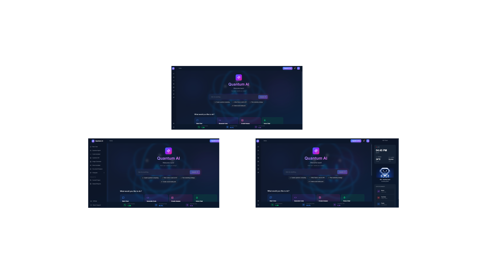
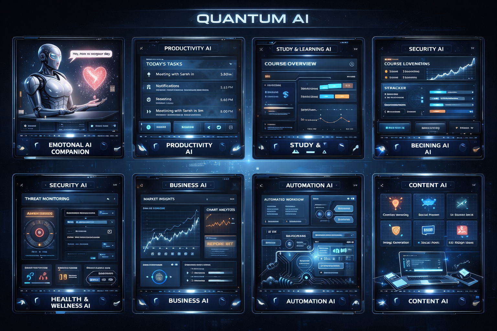
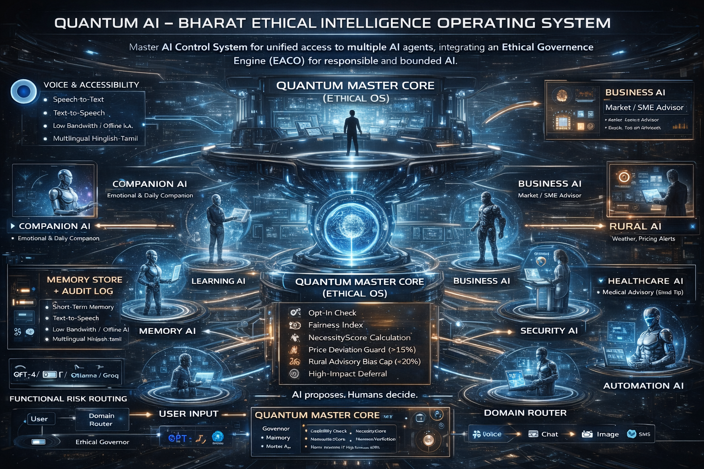
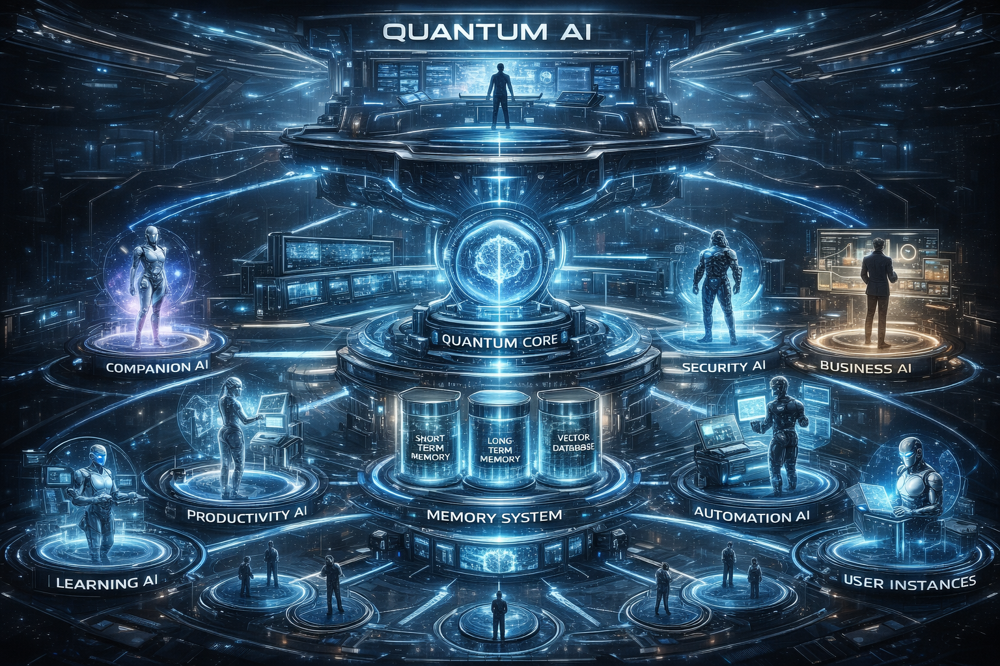

# Quantum AI Bharat OS

> **AI Proposes. Humans Decide. Bharat Thrives.** 🇮🇳

An ethical, human-controlled AI platform designed specifically for Bharat (India), combining multiple AI modules under centralized Master Control to serve students, patients, farmers, and small businesses.

---

## 🎯 Vision

Quantum AI Bharat OS is built to democratize AI access across India while ensuring:
- ✅ Human authority over AI decisions
- ✅ Privacy protection (zero chat monitoring)
- ✅ Fairness enforcement (especially for rural communities)
- ✅ Ethical AI with transparency
- ✅ Bharat-first design (multi-language, low-bandwidth, voice input)

### Quantum AI Interface

<p align="center">
  
</p>

---

## 📊 System Architecture

<p align="center">
  
</p>

---

## 🤖 AI Modules

<p align="center">
  
</p>

### 🎓 Learning AI
Personalized education assistant for students and developers
- Study plan generation
- Code tutoring and debugging
- Course summarization
- Progress tracking

### 🏥 Healthcare AI
Medical report analysis and health information (advisory only)
- Blood test report analysis
- Symptom explanation
- Health dashboard
- Mandatory medical disclaimer

### 🌾 Rural AI
Weather alerts and market pricing for farmers
- Real-time weather alerts (IMD integration)
- Mandi price recommendations (Agmarknet)
- Transport disruption notices
- **Ethical Fairness Algorithm** to prevent seller bias

### 🏢 Business AI
Market insights and analytics for SMEs
- Market trend analysis
- Pricing strategy recommendations
- Risk alerts
- Business automation

---

## 🏗️ Architecture

<p align="center">
  
</p>

### Architecture Layers

```
User Interface Layer (4 separate domain-specific UIs)
           ↓
    API Gateway
           ↓
   Domain Classifier
           ↓
  Quantum Master Core (Central Control)
           ↓
    AI Modules Layer
           ↓
  Ethical Governor (Bias & Fairness Check)
           ↓
  Human Governance (High-risk approval)
           ↓
      User Output
           ↓
  Encrypted Memory Store
```

### Key Components

**Quantum Master Core:**
- AI routing and orchestration
- Multi-provider fallback (GPT-4, Claude, Gemini)
- Bias monitoring
- Fairness enforcement
- Circuit breaker system

**Ethical Governor:**
- Bias detection
- Fairness validation
- Safety screening
- Risk assessment (Low/Medium/High)

**Human Governance Layer:**
- Master Control dashboard
- Approve/reject high-risk outputs
- Module suspension capability
- System health monitoring

---

## ⚖️ Rural AI Fairness Algorithm

Ensures fair and unbiased recommendations for farmers:

```
NecessityScore = Impact × Urgency × Credibility × (1 - FairnessPenalty)
```

**Components:**
- **Impact:** Number of people affected (0-1)
- **Urgency:** Time sensitivity (0-1)
- **Credibility:** Source reliability (0-1)
- **FairnessPenalty:** Seller over-exposure penalty (0-0.5)

**Fairness Rules:**
- Seller exposure cap: <20%
- Price deviation limit: <15%
- Minimum credibility: >0.6
- High-impact alerts (score >0.8) require human approval

---

## 🔒 Privacy & Security

### No Private Chat Monitoring
- ❌ Humans cannot access user conversations
- ✅ End-to-end encryption
- ✅ Automated safety scanning only
- ✅ User opt-in for data storage
- ✅ Right to delete data anytime

### Security Layers
1. **Network:** HTTPS/TLS 1.3, DDoS protection
2. **Authentication:** OAuth 2.0, JWT, MFA
3. **Data:** AES-256 encryption at rest, TLS in transit
4. **Privacy:** Zero human monitoring, GDPR compliant
5. **Audit:** Logs without content visibility

---

## 🛠️ Technology Stack

**Frontend:**
- React + TypeScript
- Tailwind CSS
- Progressive Web App (PWA)

**Backend:**
- Node.js (API Gateway, Routing)
- Python (AI Processing, ML Models)
- Microservices Architecture

**AI Providers:**
- OpenAI GPT-4 (Primary)
- Anthropic Claude (Fallback)
- Google Gemini (Fallback)

**Database:**
- PostgreSQL (Structured Data)
- Pinecone/Weaviate (Vector DB)
- Redis (Caching)

**Infrastructure:**
- AWS/Azure Cloud
- Docker + Kubernetes
- CI/CD Pipeline

---

## 📊 Project Structure

```
Quantum-AI-Bharat-OS/
├── README.md                          # This file
├── docs/
│   ├── requirements.md                # Detailed requirements
│   ├── design.md                      # System design document
│   ├── user-stories.md                # User scenarios & examples
│   ├── deployment-roadmap.md          # 12-month deployment plan
│   ├── rural-ai-fairness-algorithm.md # Fairness algorithm details
│   └── ui-mockup-specifications.md    # UI/UX specifications
├── diagrams/
│   ├── architecture-diagram.md        # System architecture
│   ├── system-flowchart.md            # Flow diagrams
│   └── README.md                      # Diagrams guide
└── presentation/
    └── (Presentation files)
```

---

## 🚀 Deployment Roadmap

### Phase 1: Foundation & MVP (Months 1-3)
- Infrastructure setup
- Quantum Master Core development
- Learning AI module (MVP)
- Ethical Governor implementation

### Phase 2: Healthcare & Rural AI (Months 4-6)
- Healthcare AI development
- Rural AI with fairness algorithm
- Master Control dashboard
- Human governance layer

### Phase 3: Business AI & Scaling (Months 7-9)
- Business AI development
- Performance optimization
- Security hardening
- Scalability testing

### Phase 4: Full Launch (Months 10-12)
- Public launch
- User onboarding
- Monitoring & iteration
- Expansion planning

**Budget:** ₹3.1 Crores (~$375K USD) for Year 1

---

## 📈 Success Metrics

**User Metrics (Year 1 Goals):**
- 50,000+ active users
- 4.2/5.0 average rating
- 60% monthly retention
- 100,000+ queries processed daily

**Technical Metrics:**
- 99.9% uptime
- <500ms response time
- <0.5% error rate
- Zero privacy breaches

**Impact Metrics:**
- 10,000+ students helped with learning
- 50,000+ medical reports analyzed
- 100+ critical weather alerts sent
- ₹5 Crores additional income for farmers

---

## 🌟 Key Differentiators

1. **Bharat-First Design**
   - Multi-language support (Hindi, Tamil, Telugu, etc.)
   - Low-bandwidth optimized (2G/3G compatible)
   - Voice input for low-literacy users
   - Regional data sources (IMD, Agmarknet)

2. **Ethical AI**
   - Fairness algorithm prevents bias
   - Human oversight for critical decisions
   - No private chat monitoring
   - Transparent audit logs

3. **Domain-Specific**
   - Unique UI/UX for each module
   - Specialized for Indian context
   - Real-world use cases

4. **Human Control**
   - AI proposes, humans decide
   - Master Control dashboard
   - Circuit breaker system
   - No AI can override humans

---

## 💡 Real-World Impact

**Learning AI:**
Priya, a CS student, learns React in 2 weeks using personalized study plan and gets her internship.

**Healthcare AI:**
Ramesh understands his blood test results, identifies high cholesterol, and takes action with his doctor.

**Rural AI:**
50,000 farmers receive cyclone warning 8 hours early, saving crops and lives.

**Business AI:**
Arjun, a handicraft seller, focuses on eco-friendly items for Diwali and increases sales by 40%.

---

## 🔮 Future Vision (Year 2+)

- Voice input in 10+ Indian languages
- Offline mode for rural areas with poor connectivity
- Mobile apps (iOS + Android)
- Integration with government schemes (PM-KISAN, Ayushman Bharat)
- Predictive modeling for crop yields
- International expansion (South Asia)
- API marketplace for developers

---

## 📚 Documentation

Detailed documentation available in `/docs`:
- [Requirements](docs/requirements.md) - Complete system requirements
- [Design](docs/design.md) - Technical design document
- [User Stories](docs/user-stories.md) - Real-world scenarios
- [Deployment Roadmap](docs/deployment-roadmap.md) - 12-month plan
- [Fairness Algorithm](docs/rural-ai-fairness-algorithm.md) - Rural AI algorithm details
- [Architecture Diagrams](diagrams/) - System architecture & flowcharts

---

## 🤝 Contributing

This project is currently in the design and planning phase. Contributions, suggestions, and feedback are welcome!

---

## 📄 License

[To be determined]

---

## 👥 Team

[Your team information]

---

## 📞 Contact

[Your contact information]

---

## 🙏 Acknowledgments

Built for Bharat, with a vision to democratize AI access while maintaining ethical standards and human control.

**"AI Proposes. Humans Decide. Bharat Thrives."** 🇮🇳

---

**Version:** 3.0 (Master Control + Rural AI Fairness Algorithm)  
**Last Updated:** February 15, 2026
